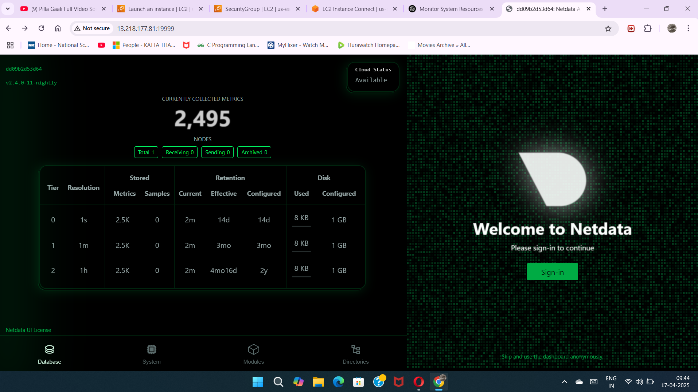

# Netdata Monitoring Task

## Objective
This project demonstrates the use of **Netdata** to monitor system resources and a **Node.js application** running inside a Docker container. The monitoring includes metrics for CPU, memory, disk usage, and container-specific data for the Node.js application.

## Tools and Technologies
- **Netdata**: Open-source monitoring tool.
- **AWS EC2**: Cloud instance to run the Docker containers.
- **Docker**: Containerization of the Node.js application and Netdata.
- **Node.js**: JavaScript runtime for building the application.
- **Express.js**: Web framework used for the Node.js app.

## Prerequisites
- **AWS EC2 Instance** running Ubuntu.
- **Docker** installed on the EC2 instance.
- **Security group configured** to allow access to port `19999` (for Netdata dashboard).

## Setup and Configuration

### Step 1: Launch EC2 Instance
- Create and launch an EC2 instance running Ubuntu.
- Open port `19999` in the EC2 security group to allow access to the Netdata dashboard.

### Step 2: Install Docker
- Install Docker on the EC2 instance by following the official Docker installation guide for Ubuntu.

### Step 3: Run Netdata using Docker
Run the following Docker command to start the Netdata container:

```bash
sudo docker run -d --name=netdata -p 19999:19999 --cap-add=SYS_PTRACE \
  -v netdataconfig:/etc/netdata \
  -v netdatalib:/var/lib/netdata \
  -v netdatacache:/var/cache/netdata \
  -v /etc/passwd:/host/etc/passwd:ro \
  -v /etc/group:/host/etc/group:ro \
  -v /proc:/host/proc:ro \
  -v /sys:/host/sys:ro \
  -v /etc/os-release:/host/etc/os-release:ro \
  -v /var/run/docker.sock:/var/run/docker.sock:ro \
  netdata/netdata
```

This command sets up Netdata to monitor the host system and Docker containers, including the Node.js app.

### Step 4: Set Up the Node.js Application

Create a simple **Node.js application** using **Express.js**. This app will run inside a Docker container.

1. **Create the `app.js` file**:

```js
const express = require('express');
const app = express();
const port = 3000;

app.get('/', (req, res) => {
  res.send('Hello from the Node.js app!');
});

app.listen(port, () => {
  console.log(`Node.js app listening at http://localhost:${port}`);
});
```

2. **Create the `package.json` file**:

```json
{
  "name": "node-app",
  "version": "1.0.0",
  "description": "Node.js application for monitoring with Netdata",
  "main": "app.js",
  "scripts": {
    "start": "node app.js"
  },
  "dependencies": {
    "express": "^4.17.1"
  }
}
```

3. **Create the Dockerfile**:

```Dockerfile
FROM node:18

WORKDIR /app

COPY package.json ./
RUN npm install

COPY . .

EXPOSE 3000

CMD ["npm", "start"]
```

4. **Build and run the Docker container** for the Node.js app:

```bash
docker build -t node-app .
docker run -d --name node-app -p 3000:3000 node-app
```

### Step 5: Monitor Node.js App Using Netdata

After running Netdata and the Node.js application, you can access the Netdata dashboard via:

```
http://<your-ec2-public-ip>:19999
```

- **Navigate to the Docker section** in the Netdata dashboard to monitor your **Node.js app container**.
- Check system-level metrics like **CPU, Memory**, and **Disk** usage, as well as **specific Docker container stats**.

### Step 6: Take Screenshots
Capture relevant screenshots of the Netdata dashboard displaying:
- **System performance** (CPU, memory, disk usage).
- **Docker container performance** (specifically the Node.js app).

---

## Screenshots

### System Monitoring (CPU, Memory, Disk, etc.)


### Node.js Application Monitoring (Docker Container Metrics)


---
---

### Author
**Tharun Katta**  
Final year student at **Alliance University**, Bangalore, India.  
Email: [tharunkatta10@gmail.com](mailto:tharunkatta10@gmail.com)  
GitHub: [tharunkatta10](https://github.com/tharunkatta10)

---
